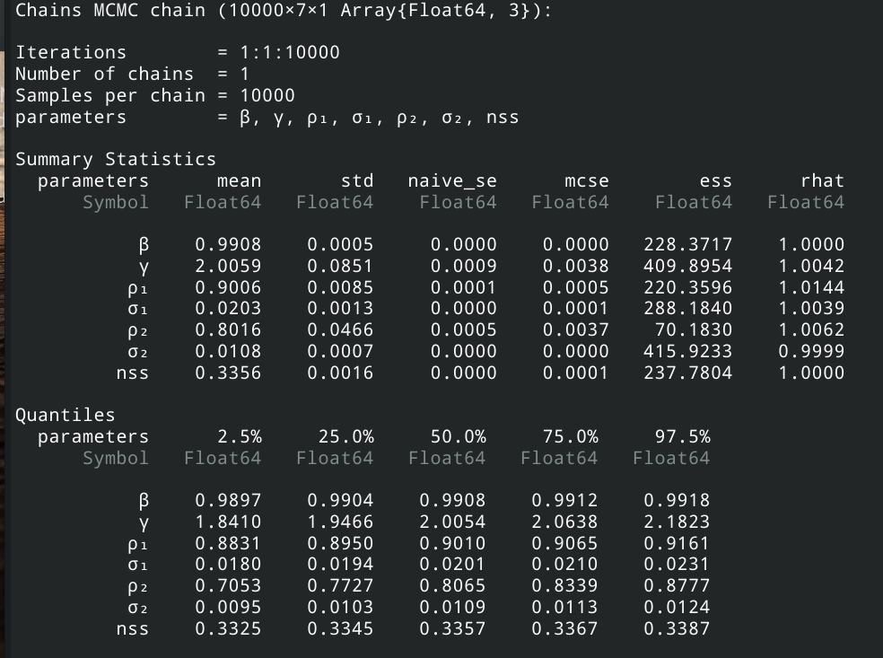
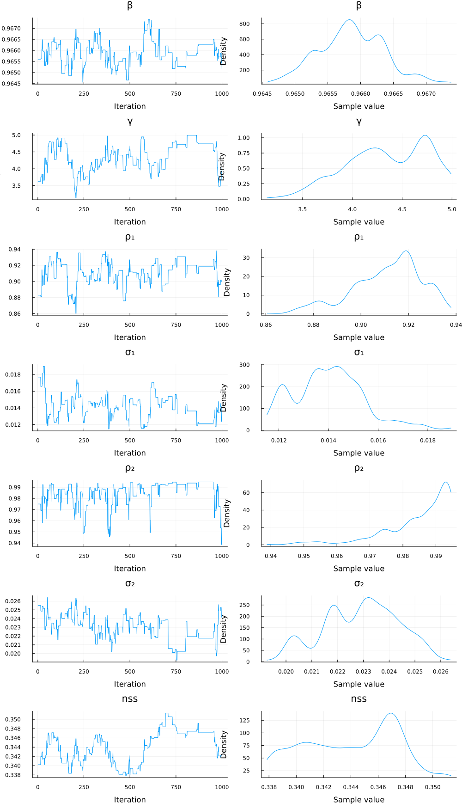
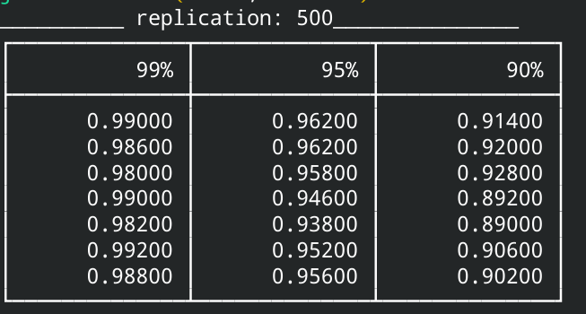

# DSGEexample.jl
This example shows how a small DSGE model may be estimated. The model is presented in Chapter 14 of the document https://github.com/mcreel/Econometrics/blob/master/econometrics.pdf  This model has two shocks, and 7 parameters to estimate. The model is solved and simulated using https://github.com/RJDennis/SolveDSGE.jl

## The model
The model description file, CK.txt, contains the lines
```
equations:
MUC = c^(-γ)
MUL = ψ*exp(η)
rate = α * exp(z) * k^(α-1) * n^(1-α)
w = (1-α)*exp(z)* k^α * n^(-α)
MUC = β*MUC(+1) * (1 + rate(+1) - δ)
w = MUL/MUC
z(+1) = ρ₁*z + σ₁ * u
η(+1) = ρ₂*η + σ₂ * ϵ
y = exp(z) * (k^α) * (n^(1-α))
k(+1) = y - c + (1-δ)*k
end
```
which should give a pretty good idea about the model being estimated. The parameters α and δ may be computed from the observed data, the rest are estimated.

## True parameter values
The true parameters used to simulate an artificial sample are
```
function TrueParameters()
 [
 0.99,  # β
 2.0,   # γ     
 0.9,   # ρ₁  
 0.02,  # σ₁   
 0.7,   # ρ₂  
 0.01,  # σ₂   
 8.0/24.0]  # nss
end
```

## Estimation results
Using a sample generated at these parameter values, estimation results are



The chain and marginal posteriors are



 
## Monte Carlo results
There are two versions of the estimator available: one using a fixed weight matrix, and
one using a continuously updated weight matrix (see the do_cue option in src/MCMC.jl). 

Doing 500 Monte Carlo replications, by running ```mpirun -np 21 julia --project MonteCarlo.jl``` the following results were obtained for the coverage of confidence intervals defined by quantiles of the MCMC chain, for each of the seven estimated parameters:

### First, for the fixed weight matrix option: ###


Some of these coverage values are statistically significantly different from what is expected for truly accurate confidence intervals, but most are not, and the departures from correct coverage are not large. The Monte Carlo means, medians, and standard deviations are in the second panel. We see that the estimator has extremely low bias, and thus, RMSE is essentially the same as the std. dev.

### Second, for the CUE weight matrix option: ###


These coverage results are improved, and in all cases are not significantly different from correct. Means, medians, and standard deviations are very similar to the above results for the two-step version.

In conclusion, the CUE and two-step versions obtain the same results for bias and RMSE.
The CUE version gives entirely reliable confidence intervals. The CIs from the two-step
version are too broad in some instances, and may lead to type-II errors more often than
would the CUE version.

