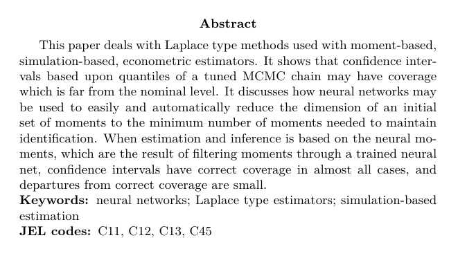
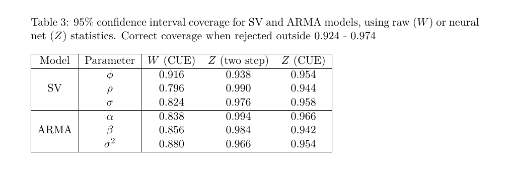
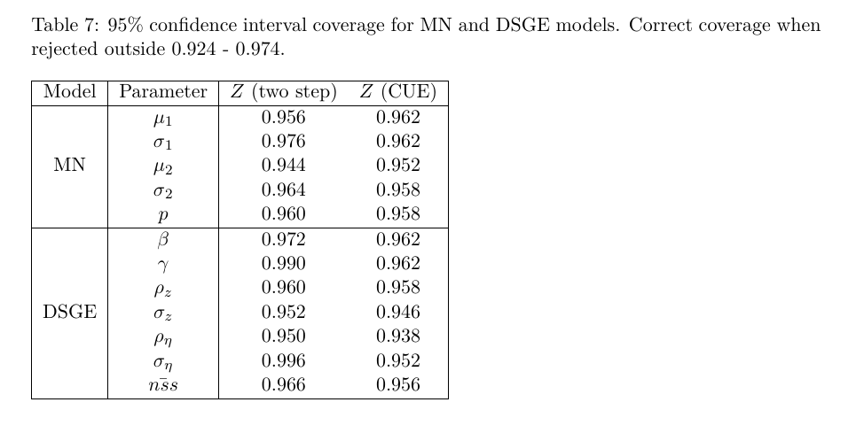

# SNM

This archive contains the code for the examples reported in the paper "Inference
Using Simulated Neural Moments", Econometrics 2021, 9(4), 35; https://doi.org/10.3390/econometrics9040035  In Releases, you can find the exact code which was used in the paper.

There is a registered Julia package [SimulatedNeuralMoments.jl](https://github.com/mcreel/SimulatedNeuralMoments.jl) which allows convenient use of the methods. The code in the master branch of this archive uses v0.30 of the SimulatedNeuralMoments package for the examples. However, the current version of SimulatedNeuralMoments.jl will no longer work to run the examples here. 

The Jump Diffusion model results have been considerably improved compared to the results in the paper, by using a data rejection strategy to eliminate economically unrealistic simulations from the training data. See the JD directory for the updated results.

Here's the abstract of the paper:

Here are 95% confidence interval coverage results for the test models. The Z (CUE) results are for the method that the paper proposes.

Stochastic volatility and ARMA models:

Mixture of normals and DSGE models:

